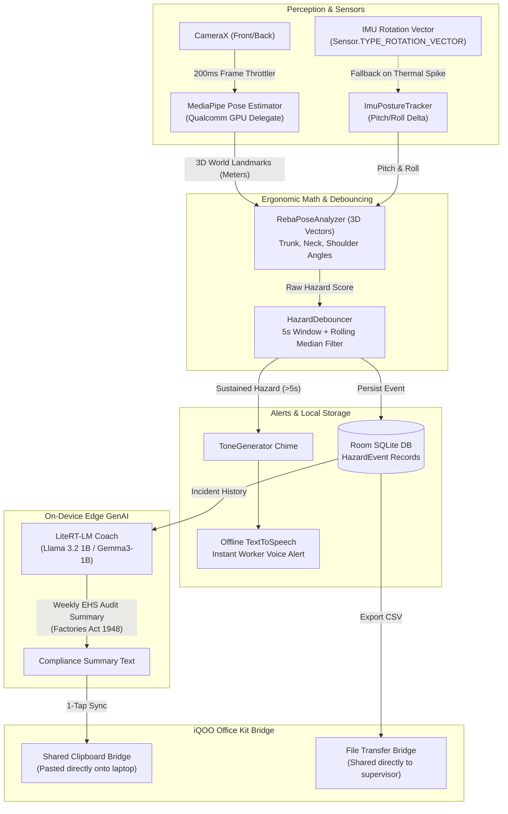

# ErgoVision (iQOO City Battles 2026)

> **Zero-Permission, 100% Offline Edge Ergonomic Hazard Detector for Industrial Assembly Lines**

[](#privacy--security-first)
[](#hard-constraints)
[](#snapdragon-thermal-architecture)
[-blueviolet.svg)](#perception-pipeline)
[](#on-device-genai-coach)
[](#office-kit-ecosystem-integration)

---

## 🏭 Executive Summary

Factory assembly line workers suffer from repetitive strain injuries and long-term musculoskeletal disorders (MSD) caused by sustained hazardous trunk flexion, neck bending, and awkward arm reaches. Existing ergonomic solutions rely on costly wearable suits or cloud-connected CCTV cameras that violate factory data privacy regulations, introduce latency, and require internet access.

**ErgoVision** transforms an **iQOO Snapdragon-powered smartphone** into an autonomous, edge-native industrial ergonomics guardian:
1. **Side-mounted at the workstation** or **clipped to a worker's pocket/belt**.
2. Operates **100% offline** with **zero `INTERNET` and zero external storage permissions**.
3. Continuously analyzes 3D posture via **MediaPipe Pose (Qualcomm Adreno GPU Delegate)** throttled to **~5 FPS** to prevent thermal throttling.
4. Alerts workers via instant **audio chime + native offline TTS** when hazardous posture is sustained for **>5 seconds**.
5. Employs on-device **LiteRT-LM** to generate personalized recovery advice and legal **EHS compliance summaries** citing **India's Factories Act 1948 (Sections 11–18)**.
6. Integrates seamlessly with laptop workstations via **iQOO Office Kit** (Shared Clipboard, CSV File Transfer, Screen Mirroring).

---

## 📐 System Architecture



---

## 🛡️ Hard Constraints

ErgoVision strictly adheres to the hackathon's operational constraints:
* **Zero Network Permissions:** No `android.permission.INTERNET` in `AndroidManifest.xml`. No packets leave the device.
* **Zero External Storage Permissions:** All incident logs reside within the sandbox (`Room SQLite`). CSV exports utilize Android's secure `FileProvider` and direct `ACTION_SEND` intents.
* **Thermal Protection:** Video ingestion is strictly throttled to **~5 FPS (200ms sleep)**, dropping to **2 FPS (500ms)** or switching to **IMU Wearable Mode** under high thermal load (`PowerManager.THERMAL_STATUS_SEVERE`), preventing GPU clock collapse.
* **Offline Determinism:** Every subsystem (Pose Detection, REBA Math, Debouncer, TTS Voice, Room DB, GenAI) executes entirely on-device without cloud dependencies.

---

## ⚡ Core Features

### 1. 3D REBA Vector Math (Invariant to Distance & Scale)
Unlike naive 2D bounding boxes that distort when a worker leans towards the camera, ErgoVision calculates true spatial vectors using MediaPipe's **3D World Landmarks** (metric coordinates centered at mid-hip):
* **Trunk Flexion:** Vector angle between mid-hip -> mid-shoulder and the vertical gravity vector. Calibrated for workstation camera tilt.
* **Neck Flexion:** Angle between mid-shoulder -> mid-ear and the torso axis.
* **Shoulder Abduction:** Arm angle relative to the torso plane.

### 2. Segment-Level Joint Risk Gradient HUD
* **Dynamic Bone Coloring:** Individual limbs reflect localized risk in real-time:
  * **Trunk:** Safe (Green <20°), Warning (Yellow 20°–60°), Severe (Red >60°).
  * **Neck:** Safe (Green <20°), Warning (Yellow >20°).
  * **Arms:** Safe (Green <60°), Warning (Yellow 60°–90°), Severe (Red >90°).
* **Workstation Tilt Calibration:** 1-tap "Calibrate" button baselines camera slant so angled phone mounts never cause false positives.
* **OLED Low-Power Dimmed Mode:** Reduces screen brightness and disables overlay rendering during long shifts to save battery and reduce heat.
* **Audio Mute Toggle:** Instant HUD control (`🔊` / `🔇`) for quiet testing environments.

### 3. Dual Mode: Vision + Wearable Pocket/Belt IMU
* **Stationary Vision Mode:** Phone is mounted on the workstation bench running CameraX + MediaPipe.
* **Wearable IMU Mode:** Phone slips into the worker's pocket or belt clip. Uses `Sensor.TYPE_ROTATION_VECTOR` to monitor trunk flexion directly via pitch and roll without camera usage.
* **Auto-Thermal Fallback:** If the device experiences high thermal load, ErgoVision can transition from Camera to IMU mode automatically to preserve battery and cool the chip.

### 4. Sliding Window Debouncer with Median Filter
* Requires sustained bad posture for **5 consecutive seconds** (with an 80% coverage threshold).
* **Rolling median filter** rejects transient noise spikes (e.g., worker picking up a dropped bolt for 1 second).
* Enforces a **15-second cooldown** after each alert to prevent worker alarm fatigue.

### 5. On-Device LiteRT-LM & EHS Legal Audit
* Generates micro-coaching advice per incident (e.g., *"Adjust parts bin 15cm higher to maintain neutral lumbar curve"*).
* Generates full EHS audit reports citing legal workplace standards:
  > *"Under Sections 11–18 of India's Factories Act 1948, employers are obligated to eliminate repetitive strain conditions. Workstation #4 logged 14 severe trunk flexion incidents..."*

### 6. iQOO Office Kit Cross-Device Ecosystem
* **Shared Clipboard:** 1-tap exports the on-device GenAI compliance report directly to the factory floor supervisor's laptop clipboard.
* **File Transfer:** Instantly exports all raw Room DB incident logs as formatted CSV for enterprise audit pipelines.
* **Screen Mirroring:** Streams the real-time posture HUD and risk gauges onto laptop monitors for training or ergonomic evaluations.

---

## 🚀 Quickstart & Verification

### Running the App via Android Studio
1. Open the project root in **Android Studio Ladybug / Koala / Hedgehog**.
2. Connect your **iQOO Snapdragon device** via USB with USB Debugging enabled.
3. Select the `app` target and click **Run (Shift + F10)**.
4. Grant the single runtime permission: **Camera** (`android.permission.CAMERA`).

### Fast Automated Jury Verification Script
We provide an automated verification script that executes adb commands to prove compliance, test DB persistence, and inspect CSV exports:

```bash
chmod +x demo_compliance.sh
./demo_compliance.sh
```

**Script Actions:**
1. **Audits Permissions:** Verifies `android.permission.INTERNET` is **NOT** present in the package dumpsys.
2. **Thermal & Battery Status:** Reads device battery temperature and thermal governor.
3. **Simulates Hazard Event:** Triggers a synthetic 65° trunk flexion incident directly into Room DB.
4. **Verifies Room DB & CSV:** Dumps incident logs and transfers the exported CSV report.

---

## 🧪 Unit Test Suite

ErgoVision includes comprehensive JUnit 4 test suites:
* `RebaPoseAnalyzerTest.kt`: Tests 3D vector trigonometric angles, upright low-risk baseline, severe trunk flexion detection, and camera tilt baseline calibration.
* `HazardDebouncerTest.kt`: Tests safe posture rejection, sustained 5s sliding window trigger, rolling median noise spike rejection, and 15s cooldown enforcement.

---

## 📂 Project Structure

```
ergovision/
├── app/src/main/
│   ├── AndroidManifest.xml              # Zero INTERNET, Foreground Camera Service
│   └── java/com/ergovision/app/
│       ├── bridge/
│       │   └── OfficeKitBridge.kt       # Shared Clipboard & CSV File Transfer bridges
│       ├── camera/
│       │   └── CameraXManager.kt        # 5 FPS throttled camera pipeline
│       ├── data/
│       │   ├── dao/HazardEventDao.kt    # Room DAO with aggregation queries
│       │   ├── database/HazardDatabase.kt
│       │   ├── entity/HazardEvent.kt    # Room entity for incident logging
│       │   └── model/                   # Data models (Metrics, Points, States)
│       ├── debouncer/
│       │   └── HazardDebouncer.kt       # 5s window + rolling median filter
│       ├── llm/
│       │   └── LiteRtLmCoach.kt         # On-device LiteRT-LM & Factories Act 1948 prompt
│       ├── math/
│       │   ├── RebaPoseAnalyzer.kt      # REBA 3D vector math & calibration
│       │   └── VectorMath.kt            # Dot product & 3D angle calculations
│       ├── pose/
│       │   └── MediaPipePoseEstimator.kt# MediaPipe Pose on Qualcomm GPU delegate
│       ├── sensor/
│       │   └── ImuPostureTracker.kt     # IMU Wearable pocket/belt tracker
│       ├── service/
│       │   └── CameraForegroundService.kt # Foreground service for continuous monitoring
│       ├── tts/
│       │   └── TtsAlertManager.kt       # Offline TTS alerts + ToneGenerator chime
│       └── ui/
│           ├── MainActivity.kt          # Compose host, thermal throttling, state wiring
│           ├── components/
│           │   ├── HazardLogSheet.kt    # Bottom sheet incident inspector
│           │   └── PostureHud.kt        # Risk skeleton, gauges, HUD controls
│           └── theme/                   # High-contrast industrial UI theme
├── docs/
│   ├── DEMO_RUNBOOK.md                  # 3-minute pitch script, live demo sequence & Q&A
│   ├── ARCHITECTURE.md                  # Full architectural specification
│   ├── TASKS.md                         # Hackathon phase checklist
│   └── ... (13 locked markdown specs)
├── demo_compliance.sh                   # Jury verification script
└── build.gradle.kts                     # Gradle configuration
```

---

## 📜 Legal & EHS Compliance
ErgoVision maps detected hazards directly to the statutory requirements of the **Factories Act 1948 (India)**:
* **Section 11:** Cleanliness & ergonomic work environment.
* **Section 14:** Elimination of continuous physiological strain and postural fatigue.
* **Section 18:** Health and safety provisions for manufacturing operations.

---

## 👥 Authors
* **Aryan Pratap Singh** — Lead Developer & Ergonomics Engineer
* Built for the **iQOO City Battles 2026** (30-Hour Hackathon).
