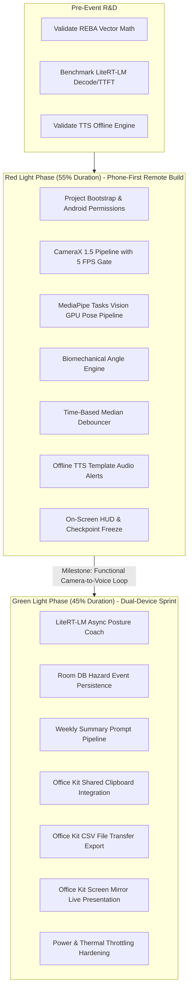

# Implementation Sequence & Hackathon Flow (FLOW.md)

## 1. Hackathon Phase Execution

## 2. Feature Dependency Graph
1. **Core Permission & Foreground Service Setup:**
   * Dependencies: None.
   * Unlocks: CameraX Lifecycle binding.
2. **CameraX Pipeline:**
   * Dependencies: Camera permissions, `SessionConfig` / manual gate.
   * Unlocks: In-memory `ImageProxy` (RGBA_8888) stream.
3. **MediaPipe PoseLandmarker:**
   * Dependencies: CameraX buffer, `pose_landmarker_lite.task` in `assets/`.
   * Unlocks: 3D World Landmarks stream.
4. **Biomechanical Angle Engine:**
   * Dependencies: 3D World Landmarks stream.
   * Unlocks: Continuous posture angles (Trunk, Neck, Shoulder).
5. **Time-Based Debouncer:**
   * Dependencies: Continuous posture angles + System timestamp.
   * Unlocks: State changes (`IDLE` -> `WARNING` -> `TRIGGERED` -> `COOLDOWN`).
6. **Tier 1 TTS Alert:**
   * Dependencies: State change to `TRIGGERED`.
   * Unlocks: Immediate spoken audio (<50ms).
7. **Room DB Logger:**
   * Dependencies: State change to `TRIGGERED`.
   * Unlocks: Historical incident records.
8. **LiteRT-LM Async Coach:**
   * Dependencies: Room DB record, LiteRT-LM runtime initialization.
   * Unlocks: Contextual natural language advice.
9. **Office Kit Exporters:**
   * Dependencies: Room DB records, LiteRT-LM summary text.
   * Unlocks: Clipboard paste & CSV export to laptop.

## 3. Milestone Checkpoints
* **Checkpoint 1 (Red Light Midpoint):** Camera feed displays skeleton overlay with real-time trunk/neck angles updating on HUD at 5 FPS.
* **Checkpoint 2 (Red Light End - Formal Evening Checkpoint):** Worker bends > 60° for 5 seconds; phone triggers instant spoken template alert ("Straighten your back"). Camera to voice loop proven without laptop intervention.
* **Checkpoint 3 (Green Light Midpoint):** Hazard resolves -> LiteRT-LM generates contextual advice asynchronously; Room logs event; weekly compliance summary copied to clipboard.
* **Checkpoint 4 (Green Light Final Demo Rehearsal):** Full system operating under Screen Mirror; zero internet permissions verified via `adb`; CSV exported via Office Kit file transfer.
